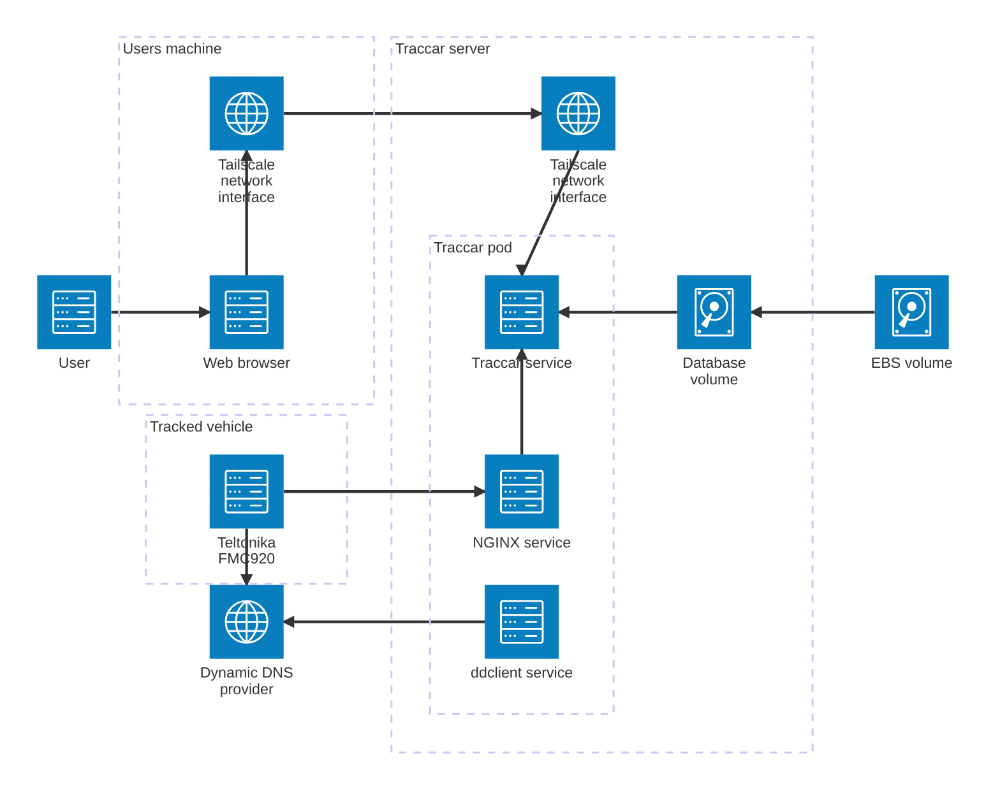

# Traccar Teltonika server

A server for [Traccar](https://www.traccar.org/) supporting
[Teltonika FMC920](https://teltonika-gps.com/products/trackers/fmc920) tracking devices.

## Features
- Small resource requirements. Currently using an AWS EC2 t4g.nano instance.
- Mutual TLS encryption (with a self-signed certificate) of tracking data between FMC920 devices
  and server.
- Secure Traccar web app access via Tailscale.

## Architecture



#### Notes
- The pod is managed by
  [podman-systemd](https://docs.podman.io/en/latest/markdown/podman-systemd.unit.5.html). This
  provides:
  - Starting of the pod if the server restarts.
  - Updates to the pod without server reprovisioning.
- The EBS volume allows Traccar data to persist with server re provisioning and without an
  external database service.
- A static IP is avoided with the use of DDNS, minimising cost.

## Requirements
- [Terraform](https://www.terraform.io/).
- [AWS](https://aws.amazon.com/).
- [Tailscale](https://tailscale.com/) with a tailnet.
- A [DDNS](https://www.cloudflare.com/learning/dns/glossary/dynamic-dns/) provider e.g.
  [Cloudflare](https://www.cloudflare.com/).

## Usage

#### 1. Prepare settings

Copy and edit the Terraform variable template.
```sh
cp template.tfvars vars.tfvars
$EDITOR vars.tfvars
```
Deployment scripts expect the Terraform variables file to be named `vars.tfvars`. Edit the file 
and enter any required values. Details and instructions for each variable may be found in
[the template](./template.tfvars). Additional variables and their defaults are declared in
[the Terraform vars file](./vars.tf).

#### 2. Prepare TF backend

Prepare and configure [the TF backend](https://developer.hashicorp.com/terraform/language/backend).
A template is provided for an S3 backend:

```sh
cp template.config.s3.tfbackend config.s3.tfbackend
$EDITOR config.s3.tfbackend
```

If you wish to use an alternative backend, update [the Terraform config](./terraform.tf). Also
update [the Terraform apply script](./scripts/apply-terraform) to reference any partial backend
files (or remove the existing argument).

#### 3. Provision resources with Terraform

> [!NOTE]  
> Steps 3-6 may be completed with a single script - `./scripts/deploy-all`

```
./scripts/apply-terraform
```

This will provision:
1. A self-signed certificate for mTLS.
2. Kubernetes secret manifests for the mTLS certificate and ddclient auth.
3. The server.

The server is configured to:
1. Update and upgrade packages.
2. Install Tailscale and join your tailnet.
3. Mount the EBS volume for podman to `/storage`. Update the fstab to mount the volume on
   reboot. Create a filesystem on the volume if none exists.
4. Install and configure podman. Set the podman graph root to `/storage`. This provides persistent
   database data.
5. Install
   [a systemd unit to run the pod](https://docs.podman.io/en/latest/markdown/podman-systemd.unit.5.html)
   with manifest located at `/storage/traccar.yaml`. The
   manifest is updated in a later step.

#### 4. Create a podman connection to the server

```sh
./scripts/create-podman-connection
```

This allows interaction with the remote podman API on the server.

#### 5. Deploy Kubernetes secrets

```sh
./scripts/deploy-secrets
```

This deploys Kubernetes secrets containing the mTLS certificate and ddclient settings. The pod
references these secrets.

#### 6. Deploy the pod

```sh
./scripts/deploy-pod
```

This copies [the pod manifest](./traccar.yaml) to `/storage/traccar.yaml` on the server which 
[systemd Quadlet](https://docs.podman.io/en/latest/markdown/podman-systemd.unit.5.html) service
- named traccar - references. After the manifest is copied, the traccar service is restarted.

## Configuring the Teltonika FMC 920

- **TODO** take screenshots of Teltonika configurator.
- **TODO** check whether the mTLS cert on the FMC920 is the full chain.
